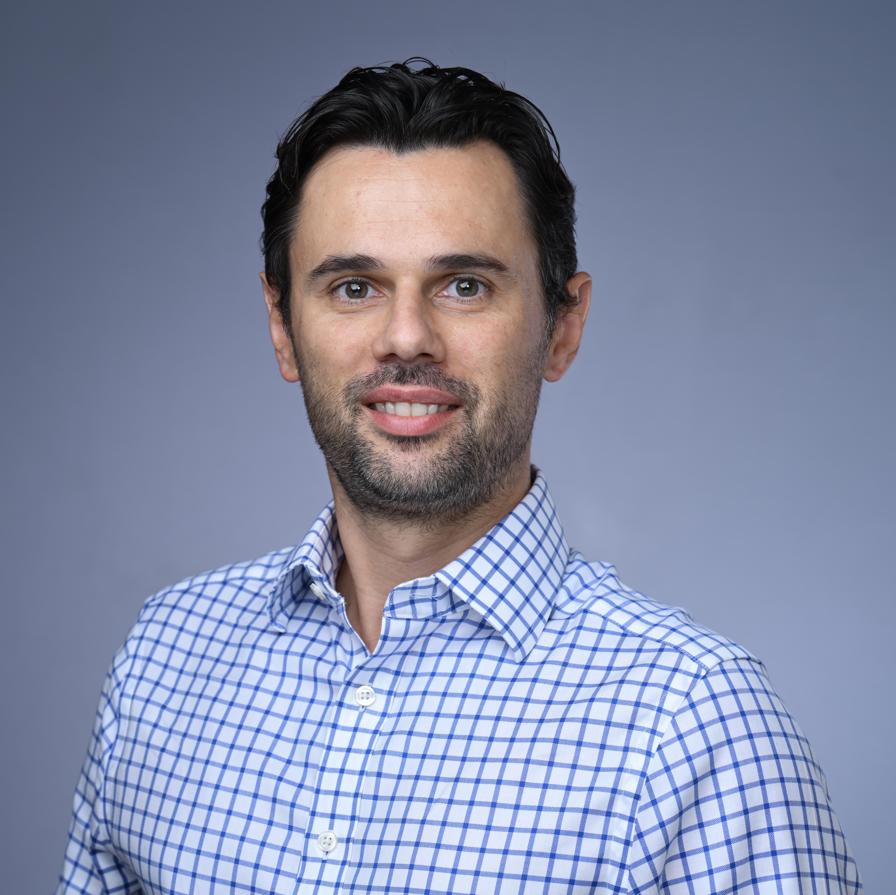

 
    

 <b>Umberto Villa, PhD</b>   <em>Research Scientist</em> 

 <a href="https://oden.utexas.edu" target="blank">Oden Institute for Computational Engineering and Sciences</a> 
<a href="https://utexas.edu" target="blank">The University of Texas at Austin</a>

 <a href="files/UmbertoVilla_cv.pdf">Curriculum vitae </a> 

 

I obtained my Ph.D. in Mathematics from [Emory University](http://emory.edu/) in December 2012 with a specialization in Computational Mathematics (high performance computing, computational fluid dynamics, image processing, inverse problems, and numerical analysis), with [Prof. Alessandro Veneziani](http://mathcs.emory.edu/~ale)([Dept. of Mathematics and Computer Science](http://www.mathcs.emory.edu/)) serving as my principal advisor.

I completed my postdoctoral training at the [Center for Applied Scientific Computing (CASC)](http://computation.llnl.gov/casc/) of [Lawrence Livermore National Laboratory (LLNL)](https://llnl.gov/) (February 2013 - February 2015), working with [Dr. Panayot Vassilevski](http://people.llnl.gov/vassilevski1) on algebraic multigrid and numerical upscaling techniques with applications to flow in porous media. After completing my postdoc, I joined the [Oden Institute for Computational Engineering and Sciences](http://oden.utexas.edu/) of [The University of Texas at Austin](http://utexas.edu/) (March 2015-July 2018) as a Reseach Associate, working with [Prof. Omar Ghattas](http://users.oden.utexas.edu/~omar) on scalable numerical methods for the solution of Bayesian inverse problems, uncertainty quantification and propagation, optimal experimental design, and optimization under uncertainty.  

After spending four years as a Research Assistant Professor of [Electrical and Systems Engeneering (ESE)](https://ese.wustl.edu/Pages/default.aspx) at [Washington University in St. Louis](https://wustl.edu) and member of the [PhD in Imaging Science Faculty](https://engineering.wustl.edu/departments-faculty/interdisciplinary-degree-programs/imaging-science/Pages/default.aspx), I rejoined the Oden Institute in the August 2022 as a Research Scientist working at the interface of imaging science and predictive scientific computing. 

